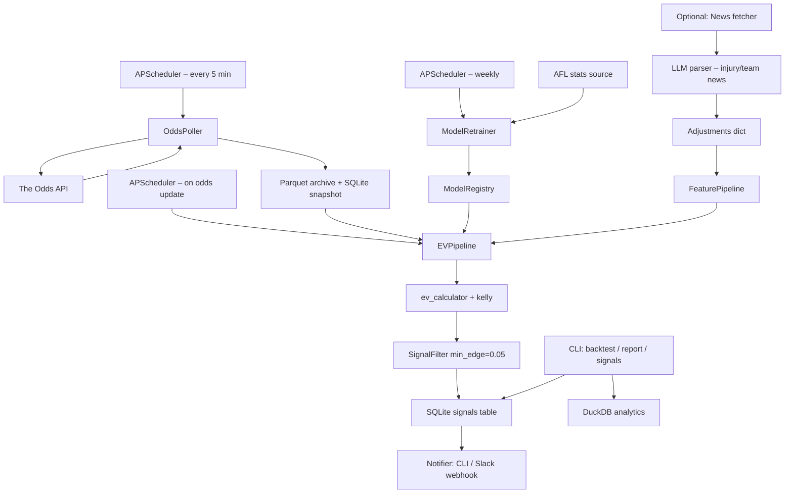

# Architecture Research: Python Stats-Driven Sports Betting Advisor

_Research date: 2026-05-15_

---

## 1. Signum Repo Analysis

**Repo:** `danielbusnz-lgtm/signum` – Autonomous prediction market trading on Polymarket. Multi-LLM consensus engine (5 models), SQLite storage, Next.js dashboard. Paper trading: 6,841 signals logged, 65% win rate on resolved trades.

### What signum actually does

Signum is a **prediction market bot**, not a sports betting system. It operates on Polymarket's CLOB (central limit order book) where prices are set by crowd participants in a peer-to-peer market. The core loop:

1. Every 6 hours, fetch live markets from Polymarket's Gamma API
2. Filter by liquidity (spread < 3%, volume >= $5k, 24hr)
3. Claude screens top 5 candidates (Tier 1)
4. Five LLMs independently estimate true probability, with Tavily news context injected (Tier 2)
5. Outliers dropped (highest + lowest), middle three averaged to consensus
6. Signal fires if consensus edge >= 12% and disagreement <= 15%
7. Order placed via py-clob-client

**Critically:** signum explicitly skips sports markets (`if m.get("sportsMarketType") is not None: continue`). Its LLM consensus is specifically designed for **politics and world events** where LLMs have strong priors baked into training data.

### What transfers to sports betting

| Pattern | Transferability | Notes |
|---|---|---|
| **API funnel with filter pipeline** | High | Fetch, filter by liquidity/spread, score candidates – this shape maps cleanly to odds ingestion |
| **SQLite for signal storage** | High | Appropriate for single-user, low write volume. Signum uses SQLite/Turso with a thin abstraction layer |
| **Isotonic calibration module** | High | `calibration.py` applies isotonic regression to map raw model probabilities to resolved outcomes. This is exactly what a model calibration step looks like. Steal this pattern |
| **Retry logic with tenacity** | High | `@_llm_retry` decorator with exponential backoff – useful for any external API calls |
| **Structured schema for signals** | High | Separating signal logging from execution is clean. Apply to recommendation records |
| **Pydantic models for LLM structured output** | Medium | Useful if LLM is in the loop at all. For deterministic steps, unnecessary |
| **Multi-LLM consensus (5 models vote)** | Low | LLMs have genuine knowledge priors on political/world events. They don't on AFL team form vs. market odds |
| **Tavily news injection** | Medium | Useful specifically for injury/team news parsing. Not for probability estimation |
| **CLOB order execution** | None | Fixed-odds bookmakers use REST APIs and manual bet placement, not order books |
| **Tier 1 Claude screening** | Low | Signum uses LLM to pick interesting markets from 500 candidates. For AFL (~9 games/week), human curation or simple filter rules are sufficient |

### What does NOT transfer

**The fundamental domain mismatch:** Prediction markets price events via crowd wisdom converging on true probabilities. The LLM consensus works there because LLMs have absorbed massive amounts of political/geopolitical text and can genuinely outperform thin prediction market crowds on niche events. AFL fixed-odds bookmakers run sophisticated statistical models backed by decades of data, sharp bettor action, and professional line-setters. An LLM cannot probabilistically beat a Sportsbet line on AFL handicap any more than it can beat a market-maker's quant model. The edge (if any) comes from a better statistical model, not from language model reasoning.

---

## 2. Reference Architectures for Sports Betting Systems

### What working systems actually look like

Public implementations across GitHub and quantitative betting communities converge on a consistent shape:

**Typical production-grade quant betting pipeline:**

```
Historical data → Feature engineering → Model training → Backtest
                                                              ↓
Live odds (polling) → Feature extraction → Model inference → EV calc → Filter → Recommend
                                                              ↓
                                                        Logging / audit
```

**Notable public examples:**

- **ATP Value Betting Algorithm** ([jacksonpc2024](https://github.com/jacksonpc2024/ATP-Value-Betting-Algorithm)): Pure Python. Elo ratings on 25 years of ATP data, compares model probability to Bet365 lines, 34.72% ROI at 20% edge threshold. Monte Carlo for bankroll simulation. No agents, no LLMs, no orchestrator. Single `main.py` with clean helper modules.

- **NBA ML Sports Betting** ([kyleskom](https://github.com/kyleskom/NBA-Machine-Learning-Sports-Betting)): XGBoost/neural net on team stats. Pipeline collects stats + odds, merges into training dataset, `main.py` fetches today's schedule, builds features, loads trained models. Flask for browsing outputs. Again: no agents.

- **georgedouzas/sports-betting**: Scikit-learn compatible pipeline components for dataloaders, feature engineering, and backtesting. CLI + GUI available. Modular but deterministic.

- **Joseph Buchdahl** ([football-data.co.uk](https://www.football-data.co.uk)): The benchmark academic on quantitative betting. His methodology is entirely statistical – Poisson models, Elo ratings, regression, significance testing of historical P&L. No language models anywhere. His published research on favourite-longshot bias, ratings systems, and Kelly staking is the intellectual foundation for serious value betting.

**Key observation:** Every serious public betting system is a **deterministic Python pipeline**, not an agent system. The "AI" is a trained statistical model (Elo, XGBoost, logistic regression, Poisson). The pipeline fetches data, scores games, computes EV against market lines, applies a Kelly fraction, and outputs recommendations.

### Orchestration patterns observed

- **Cron + scripts:** Most common. Simple, debuggable, no infrastructure to maintain.
- **APScheduler embedded in a long-running Python process:** Used when polling frequency needs to be configurable at runtime, or when you want multiple intervals in one process (e.g., poll odds every 5 min, retrain model weekly).
- **Prefect/Airflow:** Only at scale (multiple sports, multiple books, team environment). Significant overhead for a single-user system.

---

## 3. When LLM Agents Help vs. Hurt – Honest Assessment

### Where LLMs genuinely add value

| Task | Verdict | Reasoning |
|---|---|---|
| **Injury / squad news parsing** | Useful | Free-text AFL injury lists, "Dusty is late out, named in starting squad" – structured extraction via LLM is faster than regex. Maps to signum's Tavily pattern |
| **Market anomaly explanation** | Useful | Once a statistical signal is found, an LLM can summarise what news context might explain it. For human-readable output only |
| **Rationale generation for recommendations** | Useful | "This line looks short given model says X% vs market Y%" – LLM can write legible summaries of a deterministic output |
| **New sport onboarding** | Marginally useful | Summarising rules, key variables for a new sport (NRL vs AFL) to assist feature engineering decisions |

### Where LLMs are dead weight

| Task | Verdict | Reasoning |
|---|---|---|
| **Probability estimation** | Do not use | LLMs are systematically overconfident. The signum calibration file itself documents this: frontier LLMs at 95% confidence are correct only 70% of the time on prediction markets. AFL fixed-odds markets are priced by sharper processes than LLM priors |
| **EV calculation** | Do not use | This is arithmetic: `ev = (model_prob * decimal_odds) - 1`. No language model required |
| **Model fitting / training** | Do not use | Sklearn, XGBoost, or Pymc3 are the tools. LLMs cannot fit parameters to historical data |
| **Kelly stake sizing** | Do not use | Pure math. `f = (bp - q) / b`. Deterministic |
| **Calibration** | Do not use | Isotonic regression on resolved outcomes. Statistics, not language |
| **Devigging / margin removal** | Do not use | Proportional normalization or Shin method. Two lines of Python |
| **Backtest simulation** | Do not use | Vectorised pandas/numpy operations |

### The 8-agent brief: verdict by agent

| Proposed Agent | Verdict | What it should actually be |
|---|---|---|
| **Market data agent** | Reject as LLM | A scheduled Python function that calls The Odds API. An `OddsClient` class. ~50 lines |
| **Modelling agent** | Reject as LLM | A trained scikit-learn or XGBoost model loaded from disk. A `ModelRegistry` class that loads versioned `.pkl` or `.joblib` files |
| **News agent** | Accept as LLM (narrowly) | LLM-powered extraction of injury/team news from RSS feeds or scraping. Return structured JSON. One function, not a running agent |
| **Inefficiency agent** | Reject as LLM | `ev = model_prob * decimal_odds - 1`. A pure function |
| **Multi-builder agent** | Reject as LLM | A loop across bookmakers in the odds snapshot. One function |
| **Risk agent** | Reject as LLM | Kelly fraction calculator. A pure function. Config-driven max stake |
| **Evaluation agent** | Reject as LLM | Backtesting + calibration utilities. sklearn + pandas |
| **Debate agent** | Reject as LLM | This is the signum pattern applied where it does not belong. Multi-LLM debate adds noise on top of an already-uncertain probability estimate, does not reduce it |

**Summary:** The 8-agent design should collapse to: one deterministic Python pipeline + one optional LLM call for news extraction. That is it.

---

## 4. Storage Choices

### Access patterns for this system

| Pattern | Characteristics |
|---|---|
| **Odds snapshots** | Append-only time series. ~9 games/week, 10-30 markets per game, polled every 5-10 min = ~500-1,000 rows per day. Very low volume |
| **Model features / match data** | Historical AFL stats for model training and feature building. Read-heavy. Analytical queries (aggregations, rolling averages) |
| **Recommendations / signal log** | Append-only, low volume. Audit trail of every recommendation generated |
| **Resolved bets / P&L** | Low volume. Reporting queries |
| **Model artefacts** | Binary files (`.pkl`, `.joblib`). Not in a database |

### DuckDB vs Postgres vs SQLite vs Parquet

**For this scale (single user, AFL only, 9 games/week):**

| Option | Verdict |
|---|---|
| **DuckDB** | Strong choice for the analytical layer. Zero infrastructure. File-based. Vectorised columnar queries are fast for backtest scans across historical odds. Native Parquet read/write. `pip install duckdb` and done |
| **SQLite** | Good choice for the operational layer (signal log, recommendations, resolved bets). What signum uses. ACID, zero infrastructure, easy to inspect with any SQLite browser |
| **Postgres** | Overkill for this scale. Adds infrastructure (process to manage, port to configure, pg_hba.conf). No meaningful advantage over SQLite + DuckDB for a single-user local system |
| **Parquet files** | Good for storing raw odds snapshots for backtesting. DuckDB reads them directly. Use as a cold archive, not a live store |

**Recommended split:**

```
SQLite (bet_advisor.db)         – operational: signals, recommendations, bets, P&L
DuckDB (analytics.duckdb)       – analytical: historical odds, model features, backtest results
Parquet (data/odds_archive/)    – raw odds snapshots for backtesting, written by odds poller
```

This is exactly the split signum converges on (SQLite for signals, with Parquet-style exports available). It is the right answer at this scale.

---

## 5. Orchestration

### What this system needs to schedule

1. **Odds polling** – every 5-10 minutes, AFL season only
2. **EV computation** – triggered after each odds poll, or on a fixed interval
3. **Model retraining** – weekly or per-round, after new match results land
4. **Notification dispatch** – triggered when a signal crosses threshold

### Option comparison

| Option | Verdict |
|---|---|
| **APScheduler (embedded)** | Best choice. Runs inside a single long-running Python process. Interval + cron triggers. Job stores (SQLite-backed) for persistence across restarts. Lightweight. Already likely in the stack for other projects (Vinyl Scraper uses it) |
| **Prefect** | Too heavy. Designed for team environments, DAG observability, remote workers. Significant installation and config overhead for a personal project with 4 scheduled tasks |
| **Temporal** | Enterprise-grade workflow engine. Completely inappropriate at this scale |
| **System cron** | Fine for daily/weekly tasks. Poor choice for sub-minute to minute-level polling because restarts lose state, and it does not integrate with the application's logging |
| **asyncio + polling loop** | Viable alternative to APScheduler if the whole app is async. More control, more boilerplate |

**Recommendation:** APScheduler 3.x with SQLite job store. One `scheduler.py` module. Configurable intervals via `config.toml`. The system Jacob already runs for Vinyl Scraper uses APScheduler – reuse the pattern.

---

## 6. Event-Driven vs. Batch

### AFL market timing reality

AFL markets behave in a predictable arc:
- **Monday–Thursday (days 4-7 before bounce):** Line set, early money shapes the market. Odds drift slowly. Most sharp action is 48-72 hours out.
- **Friday/morning before game:** Line movement accelerates. Team news confirmed. Late scratches, weather.
- **Final 1-2 hours before bounce:** Markets tighten sharply on confirmed squads and weather. This is where the most significant movement occurs.
- **In-play:** Some Australian bookmakers offer in-play markets, but this requires different infrastructure (true streaming, sub-second reaction). Out of scope for a stats-driven model.

### Verdict: 5-10 minute polling is correct

**Real-time WebSockets are not required.** Here is why:
- The value betting window is not in the last 30 seconds. It is in detecting a line that is inefficient relative to your model, which is a structural mispricing that persists for hours, not seconds.
- 5-minute polling catches all meaningful movements. The market does not move fast enough in the pre-bounce window to require sub-minute polling for a model-based approach (as opposed to a pure line-movement arbitrage approach).
- The Odds API supports historical and snapshot endpoints – REST polling is the standard integration pattern.

If the system later targets in-play markets, re-evaluate. For now, batch every 5 minutes is correct.

---

## 7. Modular Python Package Structure

### Recommended layout

```
bet_advisor/
├── __init__.py
├── config.py                   # Pydantic Settings – config.toml → typed config object
│
├── sports/                     # Sport adapters (strategy/protocol pattern)
│   ├── base.py                 # Protocol: SportAdapter (game_schedule, team_features, etc.)
│   ├── afl.py                  # AFL implementation: squads, ladder, stats sources
│   └── nrl.py                  # Future: NRL implementation (same interface)
│
├── bookmakers/                 # Bookmaker adapters
│   ├── base.py                 # Protocol: BookmakerAdapter (fetch_odds, normalize)
│   ├── odds_api.py             # The Odds API adapter (covers Sportsbet, TAB, Neds, etc.)
│   └── betfair.py              # Optional: Betfair exchange adapter
│
├── odds/
│   ├── poller.py               # Scheduled odds fetching, dedup, archive to Parquet
│   ├── devig.py                # Margin removal: proportional + Shin method
│   └── snapshot.py             # OddsSnapshot dataclass
│
├── models/
│   ├── registry.py             # ModelRegistry: load/save versioned models by sport
│   ├── base.py                 # Protocol: BettingModel (predict_proba, feature_names)
│   ├── elo.py                  # Elo rating model (good baseline for AFL)
│   └── gradient_boost.py      # XGBoost / LightGBM model wrapper
│
├── features/
│   ├── afl_features.py         # AFL-specific feature engineering
│   └── pipeline.py             # Feature pipeline: raw stats → model input vector
│
├── ev/
│   ├── calculator.py           # EV calc: (model_prob * decimal_odds) - 1
│   └── kelly.py                # Kelly fraction, fractional Kelly, stake sizing
│
├── signals/
│   ├── generator.py            # Combines EV + Kelly to produce BetSignal objects
│   ├── filter.py               # Min edge threshold, min Kelly fraction, max stake
│   └── models.py               # BetSignal, BetRecommendation dataclasses
│
├── news/                       # LLM-backed (optional, contained)
│   ├── fetcher.py              # RSS / scrape AFL injury/team news
│   └── parser.py               # LLM extraction: injuries, late changes → structured dict
│
├── notifications/
│   ├── base.py                 # Protocol: Notifier (send)
│   ├── slack.py                # Slack webhook notifier
│   └── cli.py                  # Rich terminal output (MVP delivery method)
│
├── storage/
│   ├── db.py                   # SQLite connection helpers (steal signum pattern)
│   ├── signals_repo.py         # CRUD for BetSignal table
│   └── analytics_db.py        # DuckDB connection for backtest / reporting queries
│
├── backtest/
│   ├── runner.py               # Walk-forward backtest over historical odds + outcomes
│   ├── metrics.py              # ROI, CLV, Brier score, calibration curves
│   └── report.py               # Print / export backtest results
│
├── scheduler.py                # APScheduler setup – wires together poller + signal generator
└── cli.py                      # Click CLI: run, backtest, report, signal history
```

**Key design principles:**
- `sports/` and `bookmakers/` are Protocol-based adapters. Adding NRL is creating `sports/nrl.py` that implements `SportAdapter`. The core pipeline does not change.
- `news/` is isolated. Remove it and everything else still works. This is where the LLM touches the system.
- No circular imports. Data flows in one direction: `sports` + `bookmakers` → `odds` → `features` → `models` → `ev` → `signals` → `notifications`.

---

## 8. Slack / Agentic OS Integration

### Current reality

`bet-advisor/` is an empty directory. There is no existing agentic OS inside it. There is a separate `match-bet/` project (arbitrage) which has different goals and should not be coupled to.

### Recommended approach: standalone first, clean integration point

Build bet-advisor as a completely standalone Python application. The integration surface should be a **webhook or CLI**, not tight coupling to any other project's internals.

**For MVP:** Rich CLI output via `rich` library. Running `python -m bet_advisor signals` prints today's signals in the terminal. Zero infrastructure dependency.

**For Slack notifications:** A `SlackNotifier` that posts to a webhook URL configured in `config.toml`. One HTTP POST. No shared codebase with other projects.

**For future agentic integration:** The clean integration point is either:
1. A JSON API (FastAPI, minimal) that any agent can query: `GET /signals/today`, `GET /recommendations`
2. An MCP server exposing `get_signals`, `get_p_and_l` tools – this is the right integration for Jacob's Claude Code workflow

**Do not:** couple to another project's database, import another project's modules, or share a scheduler. Each project owns its own process.

---

## 9. Observability

### What to build from day 1

**Structured logging (required):**
```python
import logging
import json

# JSON log lines for every signal generated:
# {"timestamp": "...", "sport": "afl", "game": "Richmond vs Collingwood",
#  "market": "h2h", "model_prob": 0.58, "market_prob": 0.47,
#  "ev": 0.234, "kelly_fraction": 0.088, "recommended_stake": 22.0,
#  "model_version": "elo_v2.1", "odds_snapshot_id": "abc123"}
```

Every signal must log: model version, odds snapshot ID (so you can look up the raw odds later), model probability, market probability, EV, Kelly fraction. This is the audit trail.

**SQLite signal table (required):**
Every `BetSignal` written to `bet_advisor.db`. Columns: `id`, `created_at`, `sport`, `game_id`, `market_type`, `bookmaker`, `model_prob`, `market_prob`, `decimal_odds`, `ev`, `kelly_fraction`, `recommended_stake`, `model_version`, `resolved` (NULL until settled), `outcome` (win/loss/void), `profit_loss`.

**Model version tracking (required):**
Every model artefact is saved with a version tag: `afl_elo_v1.pkl`, `afl_xgb_v2.pkl`. The `ModelRegistry` records which version was active at what time. Signal records reference the exact model version used. This makes it possible to diagnose: "the bad run in round 14 used elo_v1, which had a feature bug."

**Calibration tracking (defer, build after 50 resolved signals):**
Like signum's `calibration.py`, apply isotonic regression to map model probabilities to actual frequencies. Build this after you have enough resolved bets. Signal table schema should support it from day 1 (the `resolved` and `outcome` columns).

**What to skip at MVP:**
- Prometheus/Grafana metrics. Overkill for one user.
- Distributed tracing. No distributed system.
- Error budget / SLO tracking. Not relevant.

**Logging tool:** Python stdlib `logging` with `python-json-logger`. Write to file and stdout. No external logging service needed.

---

## 10. Testing Strategy

### What is reliably testable (build these)

| Area | Approach |
|---|---|
| **Devig / margin removal** | Pure functions. Unit test with known odds, assert fair probs sum to 1.0 and match expected values |
| **EV calculation** | Pure function. `assert ev_calc(0.6, 2.0) == pytest.approx(0.20)` |
| **Kelly fraction** | Pure function. Table-driven parametrize tests across edge cases (edge = 0, edge < 0, bankroll = 0) |
| **Signal filter logic** | Unit test: signals below minimum edge should not pass filter |
| **Deduplication in odds poller** | Unit test: same odds snapshot ingested twice = one record |
| **Feature engineering** | Snapshot tests: given a raw stats dict, assert the feature vector matches expected values |
| **Model registry** | Integration test: save a model, load it by version, assert predictions identical |
| **Storage (SQLite)** | Use `:memory:` SQLite database in tests. Test `insert_signal`, `get_open_signals`, etc. |

### What is hard to test (be honest about this)

| Area | Reality |
|---|---|
| **Model accuracy / edge** | You cannot unit test whether the model has positive expected value. This requires a historical backtest with accurate odds data and resolved outcomes – which is an empirical question, not a software test |
| **Bookmaker API integration** | Mock the HTTP responses. Real integration tests against live APIs are flaky and depend on rate limits |
| **AFL data source accuracy** | Depends on upstream data quality. Not testable in isolation |
| **LLM news extraction** | Mock the LLM client. The quality of extraction depends on the prompt + model, which changes |
| **Market efficiency assumptions** | Whether AFL markets are beatable at all is an empirical question, not testable in software |

### What to mock

- `OddsAPIClient` – return fixture JSON files of real odds snapshots. Store a few actual AFL odds responses as test fixtures.
- LLM client – `unittest.mock.patch` the news parser's LLM calls. Return pre-baked structured dicts.
- Time – use `freezegun` where scheduler logic depends on current time.

**Testing tools:** `pytest`, `pytest-mock`, `freezegun`, `responses` (for HTTP mocking). 80% coverage target on the deterministic core (`ev/`, `odds/`, `signals/`, `kelly/`). Lower coverage expectation on `news/` (LLM-backed) and `storage/` integration tests.

---

## 11. Recommended MVP Architecture

### Core proposal

Reject the 8-agent framing entirely. The system is a **scheduled Python pipeline** with a thin LLM layer for news parsing. Here is the minimal architecture that is actually useful:



### Tech stack

| Component | Choice | Version | Justification |
|---|---|---|---|
| Python | Python | 3.12+ | LTS, type hints mature, match-bet already on Python |
| Package manager | uv | latest | Faster than pip, lockfile, already used in signum |
| Config | pydantic-settings | 2.x | Typed config from `config.toml` + env vars |
| Scheduling | APScheduler | 3.x | Already in Jacob's stack (Vinyl Scraper). SQLite job store |
| Odds data | The Odds API | v4 | Covers AU bookmakers: Sportsbet, TAB, Neds, Ladbrokes, Betfair. REST, JSON |
| Statistical model | scikit-learn + XGBoost | latest | Elo as baseline, XGBoost as primary |
| Data manipulation | pandas + numpy | latest | Feature engineering, backtest |
| Operational DB | SQLite (stdlib) | – | Signals, P&L, resolved bets. Zero infra |
| Analytical DB | DuckDB | 1.x | Backtest queries, historical odds analysis |
| Parquet I/O | pyarrow | latest | Raw odds archive |
| Devigging | Custom (10 lines) or `shin` lib | – | `mberk/shin` on PyPI for Shin method |
| Notifications | slack-sdk or just `httpx` | latest | Webhook POST to Slack |
| CLI | Click + Rich | latest | Terminal output, backtest runner |
| Testing | pytest + pytest-mock + responses + freezegun | latest | |
| News LLM (optional) | anthropic SDK | latest | Claude Haiku for extraction only |

### What the brief asks for that should be DEFERRED or REJECTED

| Item | Verdict | Reasoning |
|---|---|---|
| **8 LLM agents** | Rejected | Replace with: 1 deterministic pipeline + 1 optional LLM call for news. LLMs cannot estimate AFL probabilities better than a trained statistical model |
| **Multi-LLM consensus / debate** | Rejected | Signum's own docs note LLMs are overconfident on sports. Multi-LLM voting on a domain where all LLMs share the same bias adds noise, not signal |
| **Inefficiency / EV agent** | Rejected as agent | EV is arithmetic. One function. No LLM |
| **Risk agent** | Rejected as agent | Kelly fraction is a formula. Config-driven max stake is a constant |
| **Evaluation agent** | Rejected as agent | sklearn calibration and backtesting utilities. Not an agent |
| **Agentic OS integration** | Deferred | Build standalone first. Add MCP server or REST API as integration point after MVP works |
| **Real-time / streaming** | Deferred | 5-minute polling covers AFL pre-match window. Add streaming if targeting in-play |
| **Dashboard / web UI** | Deferred | CLI first. Add a simple Streamlit or FastAPI+React dashboard only once signals are validated |
| **Multi-sport from day 1** | Deferred | Write the sport adapter Protocol from day 1 so NRL is easy to add. But implement AFL only for MVP |
| **Betfair exchange integration** | Deferred | More complex (exchange API, lay betting, liquidity considerations). Add after fixed-odds baseline works |
| **Probabilistic calibration** | Deferred | Build the schema for it on day 1 (resolved/outcome columns). Implement isotonic calibration after 50+ resolved signals |
| **Model debate / ensemble of LLMs** | Rejected permanently | Wrong tool for this domain |

### Explicit MVP scope

**MVP delivers:**
1. Odds polling from The Odds API (AU bookmakers), AFL only, 5-10 min intervals
2. Devigging (proportional + Shin)
3. Elo-based model as baseline (easy to replace with XGBoost later)
4. EV calculation per outcome per bookmaker
5. Kelly fraction + configurable max stake
6. Signal threshold filter (minimum edge, minimum Kelly fraction)
7. CLI output: today's signals, signal history, P&L summary
8. SQLite audit trail for all signals
9. Parquet archive of raw odds snapshots
10. Backtest runner: walk-forward over historical data with Brier score, ROI, CLV metrics

**MVP explicitly excludes:**
- Any LLM except optional news parser (which is a flag in config, off by default)
- Web dashboard
- Automatic bet placement
- In-play markets
- Multiple sports
- Remote deployment (runs locally)

---

## Sources

- [signum repo – danielbusnz-lgtm](https://github.com/danielbusnz-lgtm/signum)
- [ATP Value Betting Algorithm – jacksonpc2024](https://github.com/jacksonpc2024/ATP-Value-Betting-Algorithm)
- [NBA Machine Learning Sports Betting – kyleskom](https://github.com/kyleskom/NBA-Machine-Learning-Sports-Betting)
- [sports-betting Python library – georgedouzas](https://georgedouzas.github.io/sports-betting/)
- [Shin's method Python implementation – mberk/shin](https://github.com/mberk/shin)
- [Devig Python script – BettingIsCool](https://bettingiscool.com/2024/03/18/a-python-script-to-remove-the-overround-from-bookmaker-odds/)
- [The Odds API – bookmaker coverage AU](https://the-odds-api.com/sports-odds-data/bookmaker-apis.html)
- [DuckDB vs Postgres for analytics – MotherDuck](https://motherduck.com/learn/duckdb-vs-postgres-embedded-analytics/)
- [APScheduler documentation](https://apscheduler.readthedocs.io/en/3.x/userguide.html)
- [Evaluating LLM reasoning through sports betting – Timbs](https://michaeltimbs.me/blog/evaluating-llm-reasoning-through-sports-betting/)
- [Joseph Buchdahl – Fixed Odds Sports Betting](https://www.football-data.co.uk/books.php)
- [Prefect workflow orchestration](https://www.prefect.io/)
